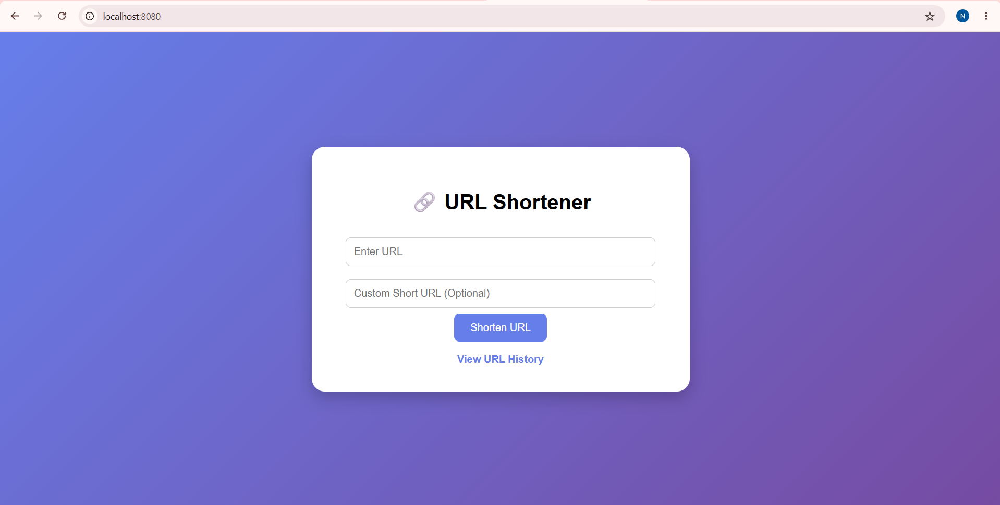
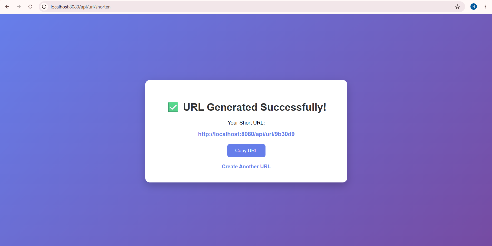
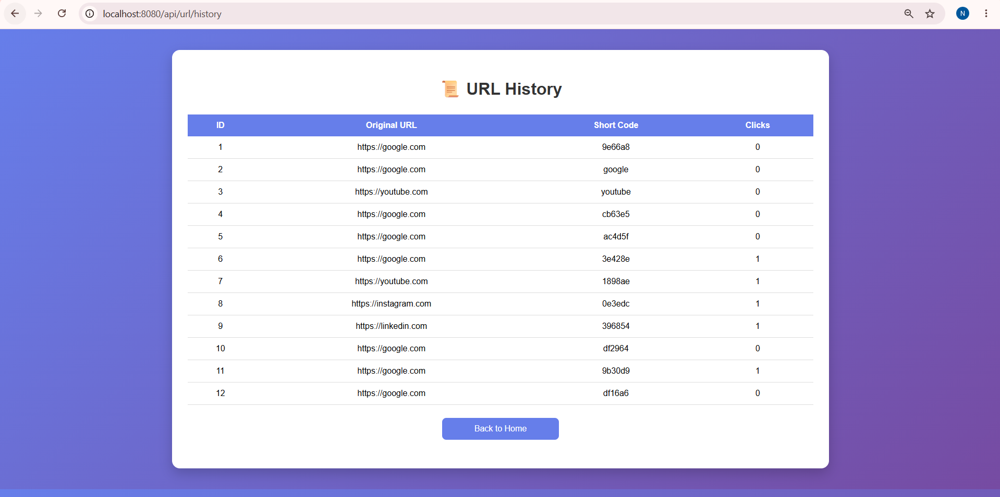
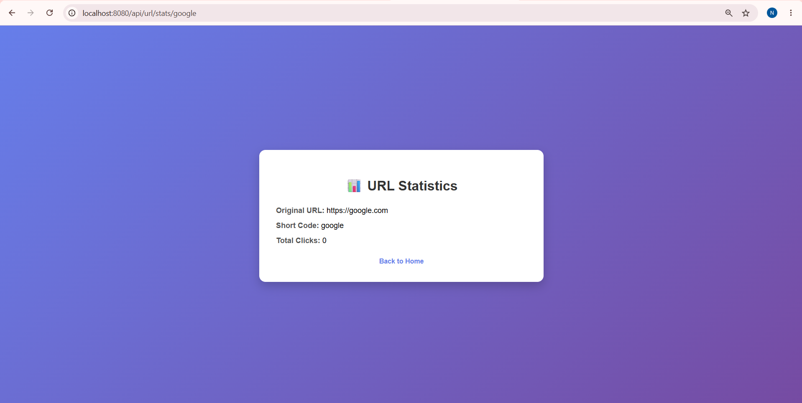

# 🔗 URL Shortener with Click Analytics

A full-stack URL Shortener web application developed using **Java, Spring Boot, Spring Data JPA, Hibernate, MySQL, and Thymeleaf**. The application allows users to shorten long URLs, create custom short URLs, track click counts, view URL statistics, manage URL history, and delete URLs through a clean web interface.

---

## 🚀 Features

- 🔗 Generate Short URLs
- ✨ Create Custom Short URLs
- 📈 Click Counter
- 📊 URL Statistics Page
- 📜 URL History
- 🗑️ Delete URLs
- 🌐 Automatic URL Redirection
- 💾 MySQL Database Integration
- 🎨 Responsive and Modern UI

---

## 🛠️ Tech Stack

- Java
- Spring Boot
- Spring Data JPA
- Hibernate
- MySQL
- Thymeleaf
- HTML5
- CSS3
- Git & GitHub

---

## 📂 Project Structure

```
src
├── controller
├── entity
├── repository
├── service
└── resources
    ├── templates
    └── application.properties
```

---

## ⚙️ Installation

### 1. Clone the repository

```bash
git clone https://github.com/YOUR_USERNAME/url-shortener-springboot.git
```

### 2. Open the project

Open the project in IntelliJ IDEA or Eclipse.

### 3. Configure MySQL

Create a MySQL database:

```sql
CREATE DATABASE urlshortenerdb;
```

Update your database credentials in:

```
src/main/resources/application.properties
```

### 4. Run the project

Run:

```
UrlshortenerApplication.java
```

Open:

```
http://localhost:8080
```

---

## 📸 Screenshots

### 🏠 Home Page



### 🔗 Generated Short URL



### 📜 URL History



### 📊 URL Statistics



---

## 🎯 Key Functionalities

- Generate unique short URLs
- Support custom short codes
- Redirect users to original URLs
- Count every URL visit automatically
- Display click statistics
- View complete URL history
- Delete unwanted URLs

---

## 📚 Concepts Used

- Spring Boot MVC
- REST Controller
- Dependency Injection
- Spring Data JPA
- Hibernate ORM
- MySQL Database
- Thymeleaf Template Engine
- CRUD Operations
- Git Version Control

---

## 👨‍💻 Author

**Nikhil**

Final Year B.Tech (Electronics & Telecommunication)

R. C. Patel Institute of Technology, Shirpur

---

## ⭐ If you like this project, don't forget to give it a Star!
